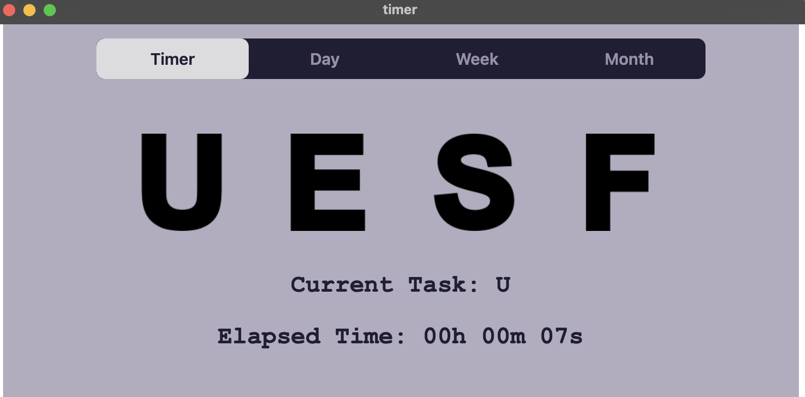
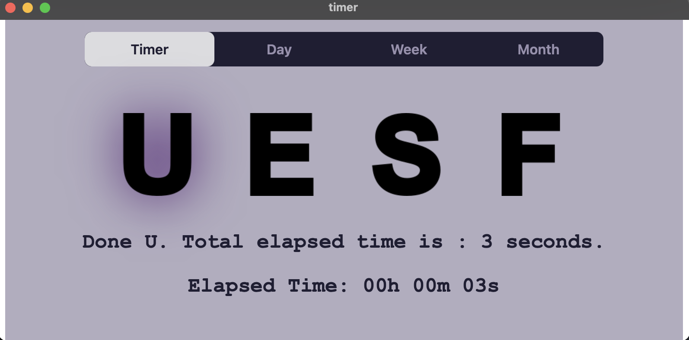
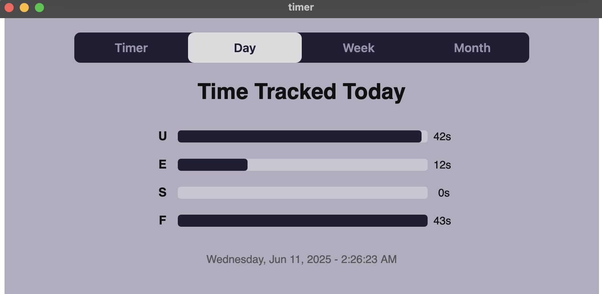
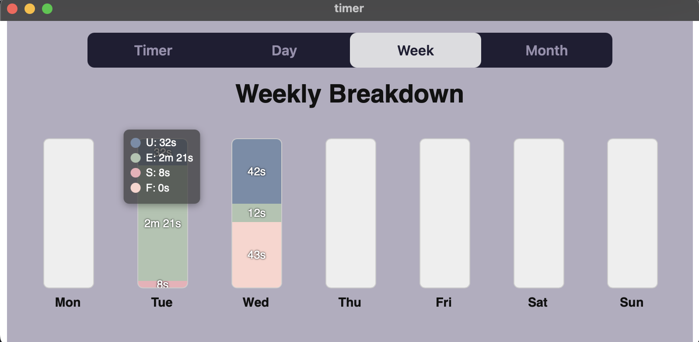
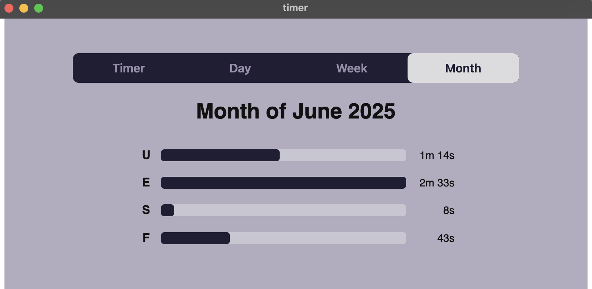

# TimeTracker

A simple app to keep track of time spent on `N` tasks (4 in this app). 

Developed using **Tauri** framework, using Vue+TypeScript as frontend, rust as backend. 

Entries are recorded in `CSV` files living inside `"path": "$APPDATA/my-app-data*"` (as defined in `src-tauri/capabilities/default.json`)

Currently supports running on MacOS & Windows x86-64.

# Screens

4 screens in total.

## 1. Timer

*press once*

*press twice*

### Functionality
1. Press a letter to start timer.
2. Press any letter again to end timer.
3. Timer keeps track of time elasped between pressing **Letter X** and pressing some other letter in the format of `hh-mm-ss`.

## 2. Day Summary

### Functionality
Displays how much time spent on each of `N` tasks in **one day** (uses LocalTime: `use chrono::Local`)

At the bottom, keeps track of the current time (updated every second).

## 3. Week Summary

### Functionality
Summary of time spent on each task in a week. 
When hovering above the bar, displays deailed breakdown.

## 4. Month Summary

### Functionality
Displays time spent on each task over one month.

---

# Build
I think you'll need to `npm i` and (install rust? not sure if needed) and then `npm run tauri dev` or `npm run tauri build` for release. For more details please refer to https://v2.tauri.app/start/.